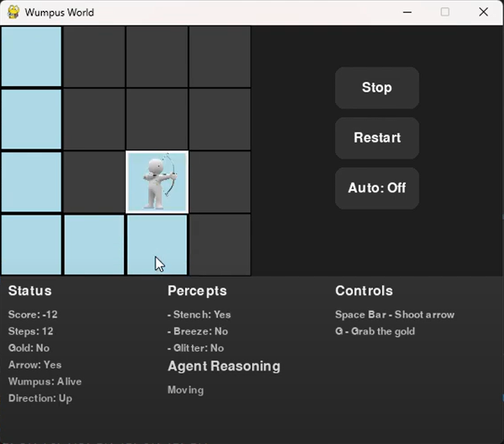

# 🕹️ Wumpus World Game  

An interactive **Wumpus World** implementation built in **Python (Pygame)** with animations, sounds, and a graphical interface.  
Navigate the cave, avoid pits, defeat the Wumpus, grab the gold, and escape alive!  

🎥 **Demo Video** → [Watch on YouTube](https://www.youtube.com/watch?v=ikOUOWSridM)  
📂 **Repository** → [Wumpus-World-Game](https://github.com/RenujaSathnidu/Wumpus-World-Game)  

---

## ✨ Features
- 🎨 **Grid-based GUI** with animated sprites and sound effects  
- 🧭 Agent actions: move, turn, shoot arrow, grab gold, climb out  
- 👂 Percept system: stench, breeze, glitter, bump, scream  
- 🔄 **Manual & Auto Play modes**  
- 📊 Score tracking & reasoning feedback  
- 🏆 Win/Lose popup with restart option  

---

## 🛠️ Tech Stack
- **Python 3**  
- **Pygame** (graphics, sound, controls)  
- **Pillow (PIL)** (for GIF frame handling)  

---

## 🚀 Getting Started

### 1️⃣ Clone the repository  

```bash
git clone https://github.com/RenujaSathnidu/Wumpus-World-Game.git <br>
cd Wumpus-World-Game
```

### 2️⃣ Install dependencies

```bash
pip install pygame pillow
```

### 3️⃣ Run the game

```bash
python wumpus_world.py
```

---

### 🎮 Controls

- ⬆️ ⬇️ ⬅️ ➡️ → Move agent
- Ctrl + ⬅️ / ➡️ → Turn left / right
- Space → Shoot arrow
- G → Grab gold
- Stop / Restart / Auto → Buttons in GUI

---

### 📸 Screenshots



---

### 📬 Contact

If you’d like to connect:

- 📧 Email: renujasathnidu@gmail.com
- 🌐 GitHub: RenujaSathnidu

---

### 📜 License

This project is open-source under the MIT License.

---

<p align="center"> ⭐ If you like this project, don’t forget to give it a star on GitHub! ⭐ </p>
